# AGENT.md — Guide Technique pour Agent IA

> Documentation technique complète du projet **Formulaire Dématérialisé DREETS BFC**.
> Version 2.5.0 — Dernière mise à jour : 13/06/2026

---

## Sommaire

1. [Contexte & Philosophie](#contexte--philosophie)
2. [Architecture & Fichiers](#architecture--fichiers)
3. [Captures d'écran de l'application](#captures-décran-de-lapplication)
4. [Schéma SQLite](#schéma-sqlite)
5. [Moteur Workflow](#moteur-workflow)
6. [Système d'authentification](#système-dauthentification)
7. [Système d'alertes](#système-dalertes)
8. [Mode Test (X-Test-Mode)](#mode-test-x-test-mode)
9. [Conventions de code](#conventions-de-code)
10. [Interdictions absolues](#interdictions-absolues)
11. [Tâches courantes](#tâches-courantes)
12. [Scripts CLI](#scripts-cli)
13. [Points d'attention](#points-dattention)

---

## Contexte & Philosophie

### Contexte métier

Application PHP de gestion de workflows de validation de formulaires pour la **DREETS** (Direction Régionale de l'Économie, de l'Emploi, du Travail et des Solidarités) — administration publique française, région Bourgogne-Franche-Comté.

Hébergée sur **Windows Server 2025 bare metal**, **IIS**, **PHP 8 FastCGI**, **SQLite**.
Auth Windows (Kerberos) fournie par IIS — `$_SERVER['AUTH_USER']` = `DOMAINE\login`.

### Répertoire de base : `C:\inetpub\wwwroot\workflow\`

Tous les fichiers PHP sont dans ce répertoire racine. Il n'y a aucun sous-dossier de code.

### Philosophie — à respecter absolument

| Principe | Description |
|---|---|
| **Zéro framework PHP** | Pas de Laravel, Symfony, Slim. PHP procédural pur. |
| **Zéro JS framework** | Pas de React, Vue, Alpine. HTML5 natif, JS minimal uniquement si strictement nécessaire. |
| **Zéro CDN** | Aucune ressource externe. Tout est local. |
| **Zéro dépendance inutile** | PHPMailer est la seule dépendance. Ne pas en ajouter. |
| **Future-proof** | Le code doit tourner sans modification dans 10 ans. Éviter toute API ou syntaxe susceptible d'être dépréciée. |
| **KISS** | Chaque fichier fait une chose. Pas d'abstraction inutile. |
| **CSS partagé** | `style.php` via `require_once`. Pas de fichier `.css` séparé. Chaque page ajoute son CSS spécifique dans un second `<style>`. |

---

## Architecture & Fichiers

### Fichiers clés (23 fichiers applicatifs)

| Fichier | Rôle | Ligne guide |
|---|---|---|
| `config.php` | Constantes globales + `APP_VERSION`. **Fichier protégé** — ne jamais écraser lors d'une mise à jour. | ~17 lignes |
| `helpers.php` | Moteur de l'application : DB, workflow, auth, CSRF, mail, audit, export CSV, test mode. | ~1323 lignes |
| `style.php` | CSS partagé inclus via `require_once`. Reset, bandeau, cards, boutons, formulaires, tables, badges, stats, timeline, workflow diagram, responsive. | ~173 lignes |
| `router.php` | Routeur simple pour le serveur PHP intégré (développement uniquement). | ~27 lignes |
| `index.php` | Page d'accueil adaptée au rôle (agent / admin). Hero banner, formulaires en cartes, statistiques, liens rapides. | ~250 lignes |
| `form.php` | Formulaire dynamique — rendu depuis `form_fields`. Groupé par `card_group`, validation, soumission POST. | ~274 lignes |
| `form_preview.php` | Prévisualisation admin d'un formulaire (lecture seule + circuit de validation visible). | ~100 lignes |
| `validate.php` | Validation par token. GET = affichage décision, POST = exécution `validate_token()`. | ~249 lignes |
| `submission_view.php` | Détail complet d'une soumission : barre de progression, diagramme workflow, deadline, données, historique, actions admin. | ~200 lignes |
| `my_submissions.php` | « Mes demandes » agent : timeline, barres de progression, badges deadline. | ~180 lignes |
| `my_validations.php` | Dashboard validateur : tokens en attente, historique, tokens expirés. | ~180 lignes |
| `dashboard.php` | Supervision admin : filtres, pagination, export CSV, deadline colorée, régénération token, annulation. | ~314 lignes |
| `monitoring.php` | Observabilité : métriques, tokens bloqués, SMTP health, donut CSS, alertes, audit. | ~300 lignes |
| `admin_access.php` | Gestion des accès admin : demande, approbation, révocation. | ~150 lignes |
| `admin_forms.php` | Form builder CRUD : formulaires, champs, étapes, destinataires, auto-génération field_name, circuit diagram. | ~350 lignes |
| `admin_alerts.php` | Configuration alertes (J-N, condition, destinataires), champ deadline, historique. | ~300 lignes |
| `admin_settings.php` | Configuration SMTP, délai de relance, plafond de relances. | ~180 lignes |
| `docs.php` | Documentation utilisateur : guides agent/validateur/admin, FAQ, architecture. | ~400 lignes |
| `changelog.php` | Journal des versions — parse `CHANGELOG.md` et affiche formaté. | ~100 lignes |
| `alert_check.php` | Script CLI : vérifie les deadlines, envoie les alertes configurées. Planifier toutes les 6h. | ~319 lignes |
| `remind.php` | Script CLI de relance automatique. Planifier toutes les 12h. | ~55 lignes |
| `update.ps1` | Script PowerShell de mise à jour automatique (télécharge, sauvegarde, préserve config.php). | ~80 lignes |

### Fichiers de test (3 fichiers)

| Fichier | Rôle |
|---|---|
| `test_all.php` | Suite de tests CLI — 47 tests en subprocess isolation (DB, helpers, workflow, pages, sécurité, fonctions avancées). |
| `test_api.php` | API de test accessible uniquement avec le header `X-Test-Mode: 1`. Actions : mails, tokens, submissions, cleanup, seeding, stats. |
| `test_http.php` | Suite de tests HTTP — démarre le serveur PHP, exécute 12 phases de tests via curl avec le header de test. |

### Navigation entre pages

```
index.php ──→ form.php?f=slug        (agent : remplir un formulaire)
          ├──→ my_submissions.php     (agent : suivi de ses demandes)
          │       └──→ submission_view.php
          ├──→ my_validations.php     (validateur : tokens en attente)
          ├──→ dashboard.php          (admin : supervision)
          │       ├──→ submission_view.php
          │       └──→ admin_alerts.php
          ├──→ admin_forms.php        (admin : form builder)
          │       └──→ form_preview.php?form_id=N
          ├──→ admin_settings.php     (admin : SMTP & relances)
          ├──→ monitoring.php         (admin : observabilité)
          ├──→ admin_access.php       (admin : gestion accès)
          └──→ docs.php               (tous : documentation)

validate.php?t=TOKEN                  (validateur : lien email à usage unique)
```

**Important** : Il n'existe pas de dossier `admin/`. Ne jamais générer de liens `href="admin/"`.

---

## Captures d'écran de l'application

> Les captures ci-dessous montrent l'application réelle avec des données de démonstration.
> Chemin des fichiers : `docs/screenshots/`

### Vue Agent

| Page | Capture | Description |
|---|---|---|
| **Accueil agent** | 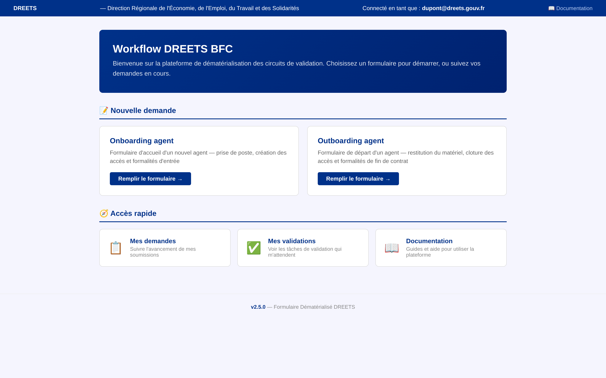 | Hero banner, formulaires disponibles en cartes, statistiques personnelles, liens rapides |
| **Formulaire onboarding** | 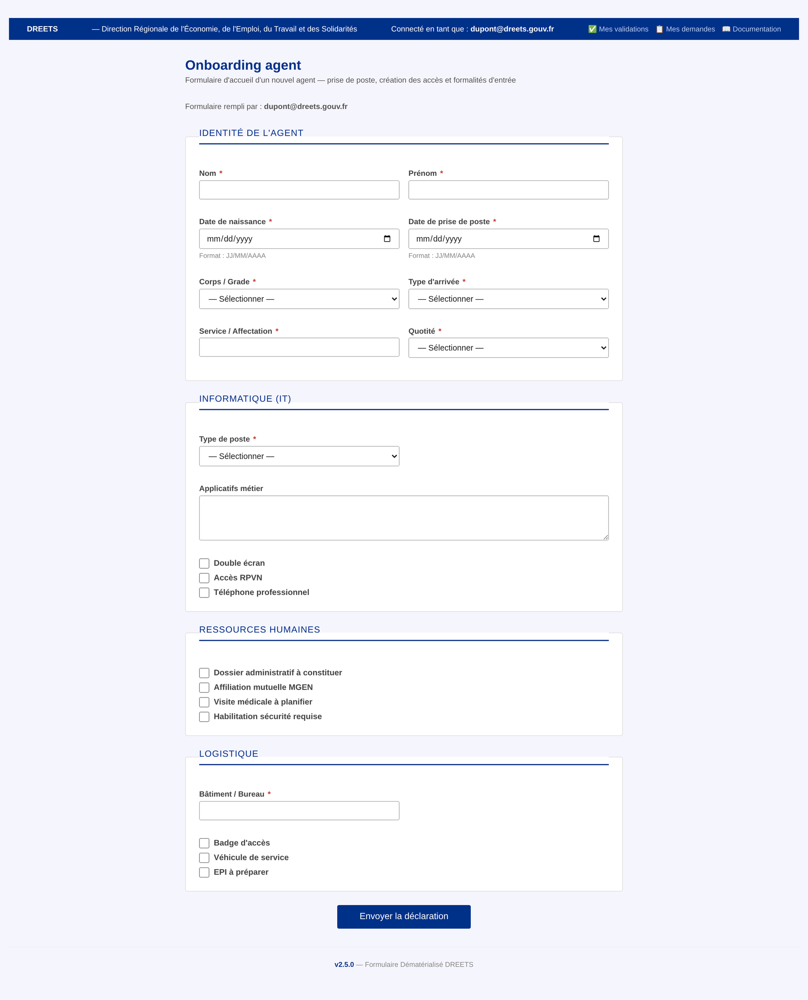 | Formulaire dynamique groupé par sections (Identité, IT, RH, Logistique), champs text/date/select/checkbox/textarea |
| **Formulaire outboarding** | 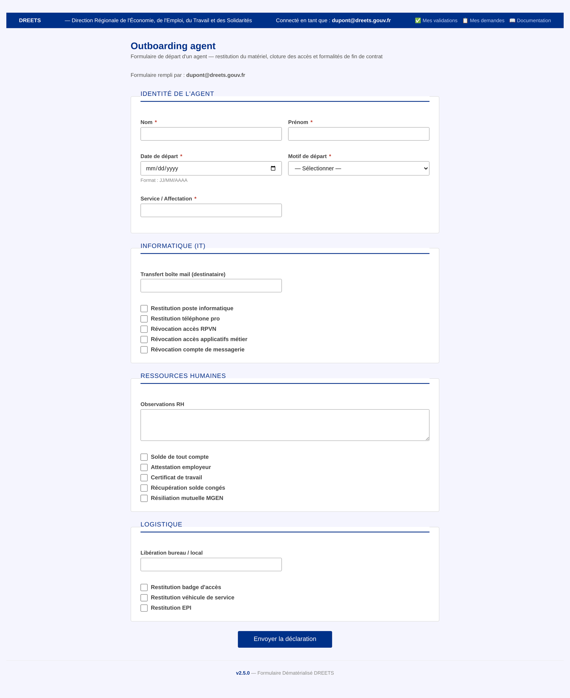 | Formulaire de départ — restitution matériel, révocation accès, formalités RH/logistique |
| **Mes demandes** | 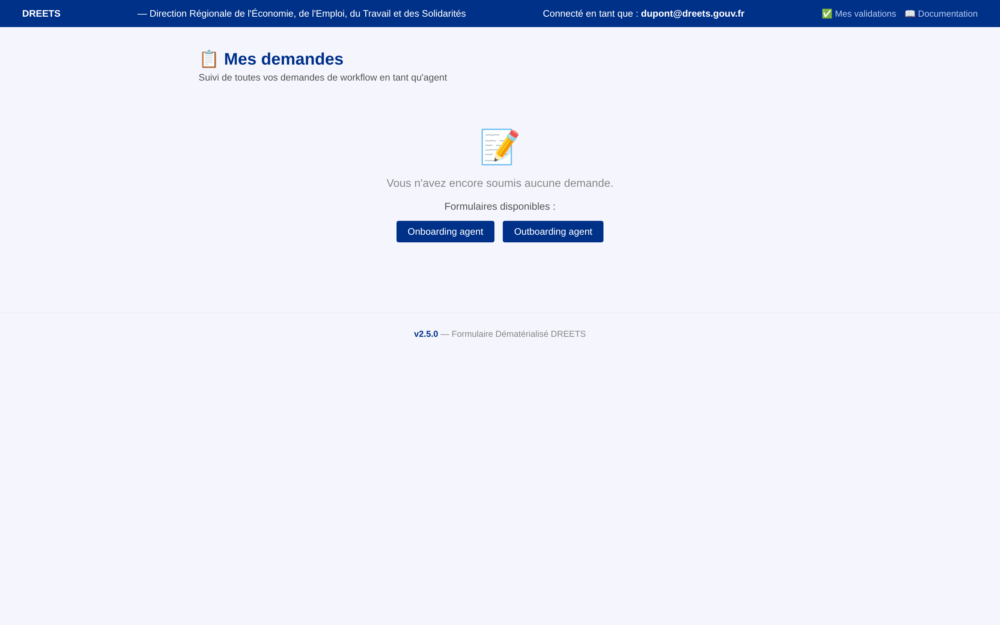 | Timeline visuelle, barres de progression, badges deadline (🚨⚠️📅), liens vers le détail |
| **Détail demande** | 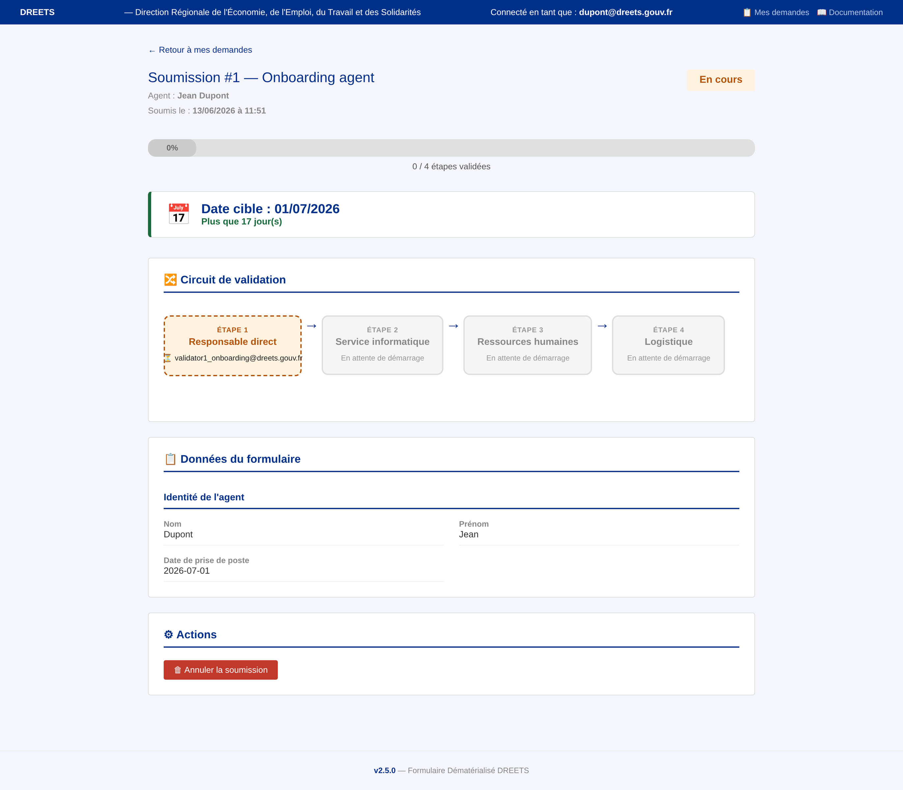 | Barre de progression, diagramme workflow, deadline, données, historique validations, actions admin |

### Vue Validateur

| Page | Capture | Description |
|---|---|---|
| **Mes validations** | 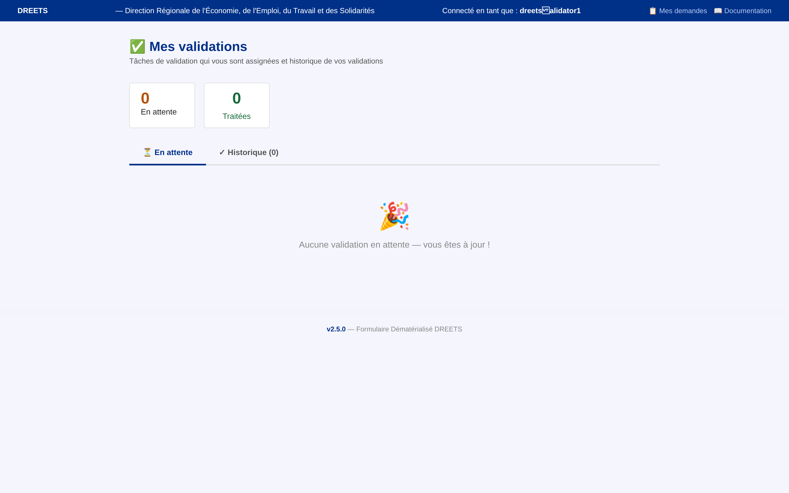 | Tokens en attente, historique des validations, tokens expirés, mini-workflow par token |
| **Page de validation** |  | Progression du circuit, formulaire de décision (valider/refuser avec motif) |

### Vue Admin

| Page | Capture | Description |
|---|---|---|
| **Accueil admin** |  | Statistiques globales, tokens bloqués, liens d'administration rapide |
| **Dashboard** | 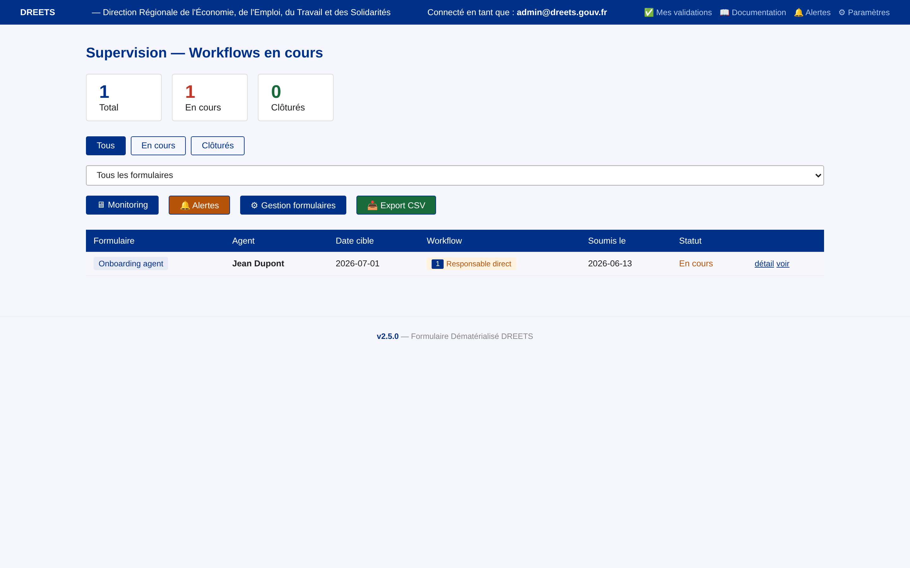 | Supervision : filtres, pagination, deadline colorée, export CSV, régénération token, annulation |
| **Monitoring** | 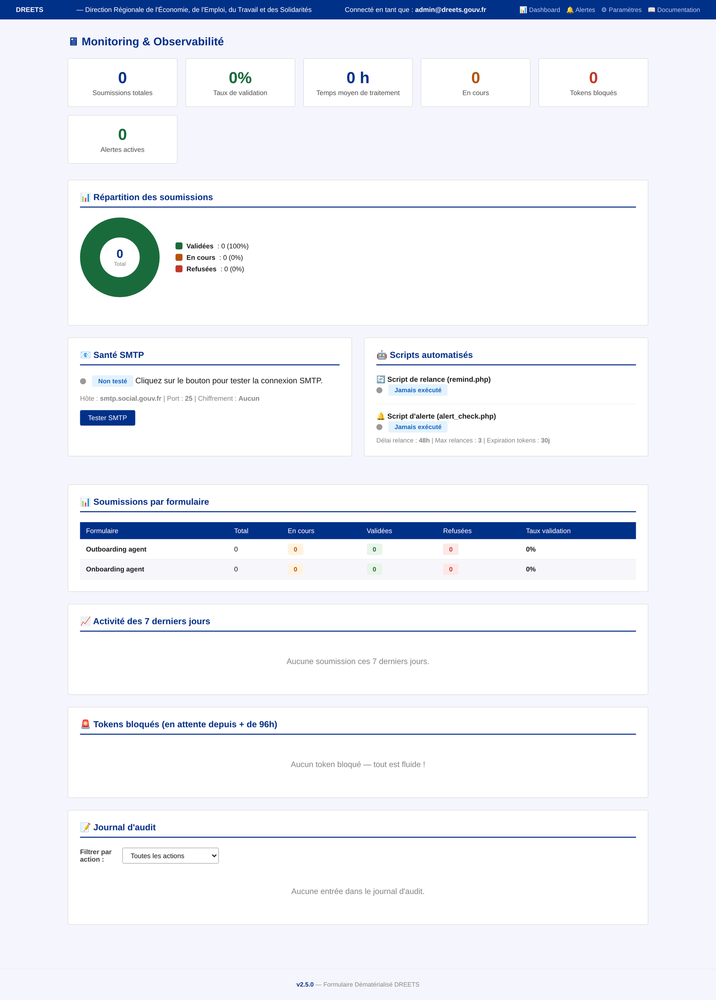 | Métriques, tokens bloqués, SMTP health, donut CSS, alertes actives, audit log |
| **Form builder** |  | CRUD formulaires/champs/étapes, auto-génération field_name, circuit diagram |
| **Aperçu formulaire** | 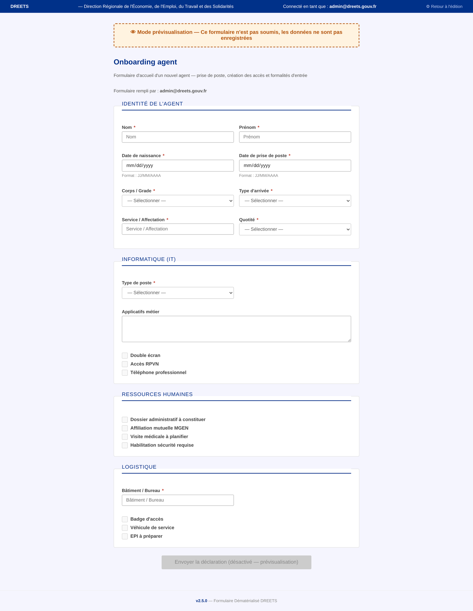 | Rendu lecture seule + circuit de validation visible |
| **Alertes** | 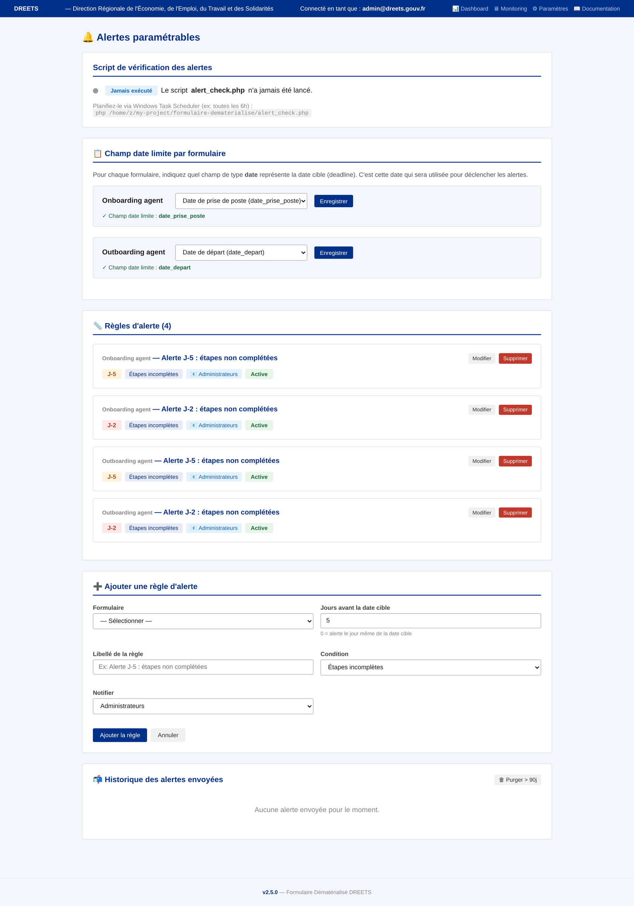 | Règles J-N, conditions, destinataires, historique des alertes |
| **Paramètres** | 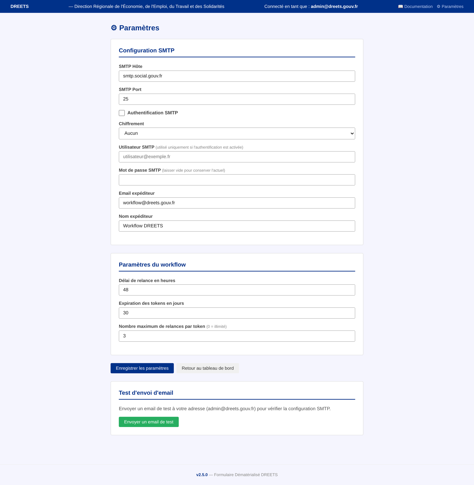 | Configuration SMTP, délai/plafond de relance |
| **Accès admin** | 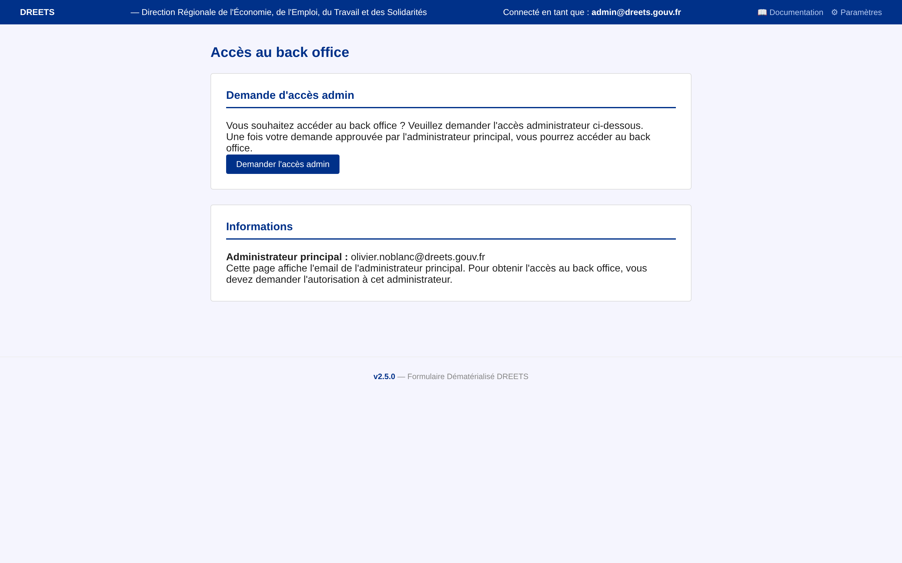 | Demande, approbation, révocation des accès admin |

### Pages transversales

| Page | Capture | Description |
|---|---|---|
| **Documentation** | 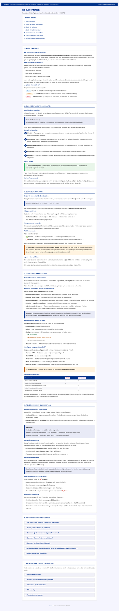 | Guides agent/validateur/admin, FAQ, architecture technique |
| **Journal des versions** | 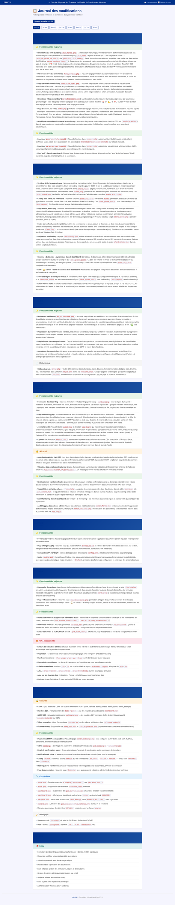 | CHANGELOG.md parsé et affiché avec icônes et couleurs |

---

## Schéma SQLite

### 13 tables

```
forms           (id, slug, label, description, actif, deadline_field, created_at)
steps           (id, form_id, label, ordre, actif)
step_recipients (id, step_id, email)
submissions     (id, form_id, data JSON, submitted_by, submitted_at, closed_at, status)
tokens          (id, submission_id, step_id, email, token, sent_at, done_at, relance_at, expires_at, relance_count)
form_fields     (id, form_id, label, field_type, field_name, options, required, ordre, card_group)
admins          (id, email, added_at)
admin_requests  (id, email, requested_at, status, token)
settings        (key, value, updated_at, updated_by)
audit_log       (id, action, target, detail, actor, ip, created_at)
alert_rules     (id, form_id, days_before, condition_type, notify_who, label, actif, created_at)
alert_log       (id, rule_id, submission_id, sent_at, message)
```

### Colonnes ajoutées par ALTER TABLE (migration automatique au démarrage)

| Colonne | Table | Version | Défaut |
|---|---|---|---|
| `status` | `submissions` | v1.1.0 | `'en_cours'` |
| `expires_at` | `tokens` | v1.1.0 | `NULL` |
| `relance_count` | `tokens` | v2.0.0 | `0` |
| `deadline_field` | `forms` | v2.4.0 | `''` |

### Types de champs (`form_fields.field_type`)

| Type | Rendu HTML | Stockage |
|---|---|---|
| `text` | `<input type="text">` | Chaîne brute |
| `date` | `<input type="date">` | Format YYYY-MM-DD |
| `select` | `<select>` avec `<option>` | Valeur sélectionnée |
| `checkbox` | `<input type="checkbox">` | `"on"` si coché, absent sinon |
| `textarea` | `<textarea>` | Texte multiligne |

### Relations clés

```
forms ──1:N── steps ──1:N── step_recipients
  │                         (email du validateur)
  └──1:N── form_fields
              (card_group pour groupement visuel)

submissions ──1:N── tokens ──N:1── steps
  (data = JSON des réponses)   (token = lien unique)
```

---

## Moteur Workflow

Le cœur de l'application repose sur deux fonctions dans `helpers.php` :

### `advance_workflow(int $submission_id)`

Appelée après chaque validation pour déclencher l'étape suivante.

**Algorithme** :
1. Récupère toutes les étapes actives du formulaire, triées par `ordre ASC`
2. Groupe par `ordre` : même `ordre` = étapes parallèles (toutes doivent être validées)
3. Cherche le premier groupe sans tokens générés → génère les tokens et envoie les mails
4. Si le groupe précédent n'est pas entièrement `done` → attend (ne rien faire)
5. Si tous les groupes sont `done` → met `closed_at` sur la soumission + notifie l'agent par email

**Exemple de workflow à 4 étapes** :
```
Étape 1 (ordre=1) : Responsable direct     → séquentiel
Étape 2 (ordre=2) : Service informatique    → séquentiel
Étape 3 (ordre=3) : RH + Logistique (ordre=3) → PARALLÈLE (2 validateurs simultanés)
Étape 4 (ordre=4) : Direction               → séquentiel
```

### `validate_token(string $token)` → `['status' => 'ok|invalid|already_done|closed', 'data' => [...]]`

Appelée quand un validateur clique sur le lien email.

**Processus** :
1. Vérifie le token en base (existe, pas expiré, pas déjà traité)
2. Si la soumission est déjà fermée → retourne `'closed'`
3. Met à jour `done_at` sur le token
4. En cas de refus : ferme la soumission (`status='refuse'`), notifie l'agent
5. Appelle `advance_workflow()` pour déclencher l'étape suivante si nécessaire
6. Retourne le statut et les données de la soumission

---

## Système d'authentification

### `get_auth_user()` dans `helpers.php`

```
$_SERVER['AUTH_USER'] = "DREETS\dupont"
                           ↓
              get_auth_user() = "dupont@dreets.gouv.fr"
```

**Logique** :
1. Si `AUTH_USER` est vide → affiche une page 401 stylisée (plus d'exception fatale)
2. Si contient `\` (format Windows `DOMAINE\login`) → extrait le login et ajoute `@dreets.gouv.fr`
3. Sinon → suppose que c'est déjà un email, passe en minuscules

### Hiérarchie des rôles

| Fonction | Vérification | Utilisation |
|---|---|---|
| `is_super_admin()` | `email === ADMIN_EMAIL` (config.php) | Accès total, suppression admin |
| `is_admin_user()` | `email IN admins` (table SQLite) | Dashboard, form builder, paramètres, monitoring |

### Flux de demande admin

```
Agent demande l'accès admin (admin_access.php)
  → admin_request créée dans la table
  → Email envoyé au super admin avec lien d'approbation
  → Lien = page de confirmation POST (pas d'effet de bord au GET)
  → Si approuvé → email ajouté à la table `admins`
```

---

## Système d'alertes

### Architecture à 3 composants

1. **`admin_alerts.php`** — Interface de configuration
   - Champ date limite par formulaire (`deadline_field` sur `forms`)
   - Règles : J-N jours avant la deadline, condition (étapes incomplètes), destinataires
   - 6 cibles : admin, agent, validateurs en cours, admin+agent, admin+validateurs, email personnalisé
   - Activation/désactivation, historique des alertes

2. **`alert_check.php`** — Script CLI (planifier toutes les 6h)
   - Parcourt les soumissions `en_cours`
   - Calcule la distance à la date cible via `deadline_field`
   - Évalue les conditions (étapes incomplètes)
   - Envoie les emails d'alerte avec tableau récapitulatif
   - Trace dans `alert_log` — déduplication : 1 alerte par règle + soumission + jour

3. **Intégration monitoring** — `monitoring.php`
   - Section « Alertes actives » avec code couleur urgence
   - Compteur dans les statistiques globales
   - Historique des dernières alertes
   - Alerte si `alert_check.php` n'a pas tourné depuis > 24h

---

## Mode Test (X-Test-Mode)

Le mode test permet de faire des tests automatisés via curl ou un navigateur headless sans modifier l'application.

### Activation

Header HTTP : `X-Test-Mode: 1`

### Comportement modifié en mode test

| Comportement | Normal | Mode test |
|---|---|---|
| Authentification | `$_SERVER['AUTH_USER']` (IIS) | `$_SERVER['HTTP_X_TEST_USER']` |
| CSRF | Vérification obligatoire | Bypass automatique |
| Emails | Envoi réel via SMTP | Interceptés dans `$GLOBALS['_test_mails']` |
| Base de données | `db/workflow.db` | `db/workflow_test.db` (séparée) |
| Erreurs | Display + warning PHP | `E_ERROR | E_PARSE` uniquement |
| Réponses | Redirections HTML | JSON pour les actions POST (erreurs, confirmations) |

### Fonction `test_json_response(array $data)`

Appelée dans les pages pour retourner du JSON au lieu de `die()` ou `header('Location: ...)` en mode test. Permet aux tests automatisés de vérifier le résultat sans parser du HTML.

### API de test : `test_api.php`

Accessible uniquement avec `X-Test-Mode: 1`. Actions disponibles :

| Action | Description |
|---|---|
| `mails` | Liste les emails interceptés |
| `reset_mails` | Vide la file d'attente |
| `tokens` | Liste les tokens de validation |
| `submission` | Détail d'une soumission |
| `submissions` | Liste toutes les soumissions |
| `cleanup` | Supprime les données de test |
| `full_cleanup` | Réinitialise complète |
| `forms` | Liste les formulaires |
| `steps` | Liste les étapes |
| `add_admin` | Ajoute un admin |
| `remove_admin` | Supprime un admin |
| `add_recipient` | Ajoute un destinataire |
| `stats` | Statistiques globales |

### Suite de tests HTTP : `test_http.php`

Démarre le serveur PHP intégré et exécute 12 phases de tests via curl :
0. Vérification serveur & mode test
1. Configuration du workflow (destinataires + admin)
2. Agent remplit le formulaire onboarding
3. Validation étape 1 (Responsable direct)
4. Refus étape 2 (Service informatique)
5. Workflow complet bout-en-bout (4 étapes validées)
6. Tokens déjà traités / invalides
7. Validation des champs obligatoires
8. Annulation de soumission
9. Régénération de token
10. Contrôle d'accès admin
11. Rendu des pages HTML
12. Vérification finale des statistiques

---

## Conventions de code

### Nommage

- Fonctions : `snake_case` (ex: `get_auth_user()`, `advance_workflow()`)
- Variables : `snake_case` (ex: `$form_fields`, `$submitted_by`)
- Tables SQLite : `snake_case` (ex: `form_fields`, `step_recipients`)
- Clés de settings : `snake_case` (ex: `delai_relance_h`, `relance_max`)

### Structure

- Pas de classes, pas d'objets (sauf PDO et PHPMailer)
- Pas de namespaces, pas d'autoloading
- `require_once __DIR__ . '/fichier.php'` exclusivement
- Chaque page suit le même modèle :

```php
<?php
require_once __DIR__ . '/helpers.php';
// ... logique métier ...
?>
<!DOCTYPE html>
<html lang="fr">
<head>
    <meta charset="UTF-8">
    <title>Titre — DREETS</title>
    <?php require_once __DIR__ . '/style.php'; ?>
    <style>
        /* CSS spécifique à cette page */
    </style>
</head>
<body>
    <?php include __DIR__ . '/bandeau.php'; /* ou bandeau inline */ ?>
    <div class="container">
        <!-- contenu -->
    </div>
</body>
</html>
```

### Sécurité

- Toujours échapper les sorties HTML avec `h()` (wrapper de `htmlspecialchars`)
- Toujours utiliser des requêtes préparées PDO — jamais d'interpolation SQL
- CSRF sur tous les formulaires POST via `csrf_field()` / `verify_csrf()`
- Tokens cryptographiques via `random_bytes(32)`
- Validation des emails via `filter_var(FILTER_VALIDATE_EMAIL)`

### CSS

- CSS commun dans `style.php` inclus via `require_once`
- Pas de fichier `.css` séparé — la philosophie est « zéro fichier statique »
- Chaque page ajoute son CSS spécifique dans un second bloc `<style>`
- Design Marianne (administration française) : bleu #003189, gris, blanc

---

## Interdictions absolues

| Interdiction | Raison |
|---|---|
| Créer des sous-dossiers de code | Architecture plate — tous les fichiers à la racine |
| Générer des liens `href="admin/"` | Ce dossier n'existe pas |
| Utiliser `__DIR__ . '/../'` | Pas de niveau supérieur |
| Introduire du routing (.htaccess, front controller) | Chaque page est un point d'entrée direct |
| Introduire du templating (Twig, Blade) | PHP natif est le moteur de template |
| Introduire un ORM (Eloquent, Doctrine) | PDO + requêtes préparées suffisent |
| Modifier le schéma sans MAJ `init_db()` | La migration doit être automatique |
| Ajouter des dépendances sans validation | PHPMailer est la seule tolérée |
| Utiliser `$_GET`/`$_POST` sans validation | Toujours valider et échapper |
| Exposer `alert_check.php`, `remind.php` via le web | Scripts CLI uniquement |
| Écraser `config.php` lors d'une mise à jour | Fichier protégé |
| Dupliquer le CSS commun | Utiliser `require_once __DIR__ . '/style.php'` |
| Utiliser du JavaScript sauf nécessité | Confirms et toggles minimes uniquement |
| Créer un fichier `style.css` | Le CSS passe par `style.php` uniquement |

---

## Tâches courantes

### Ajouter un nouveau formulaire

1. En back office (`admin_forms.php`), créer le formulaire (slug, libellé, description)
2. Ajouter les champs — le nom technique est auto-généré à partir du libellé via `generate_field_name()`
3. Configurer les étapes de validation et les destinataires
4. Le formulaire est automatiquement disponible sur la page d'accueil des agents
5. **Aucune modification de code nécessaire** — tout est dynamique via `form_fields`

### Ajouter une section à un formulaire existant

1. En back office, ajouter les champs dans le formulaire
2. Utiliser un `card_group` existant ou nouveau pour le regroupement visuel
3. Les données sont stockées en JSON — aucune migration SQLite nécessaire
4. Les mails et le dashboard affichent automatiquement les nouveaux champs

### Ajouter un type de champ

1. Ajouter le type dans le sélecteur de `admin_forms.php`
2. Ajouter le rendu dans la fonction `render_field()` de `form.php`
3. Le stockage en JSON est agnostique du type — pas de migration nécessaire

### Modifier le workflow

1. Le workflow est entièrement piloté par les tables `steps` et `step_recipients`
2. Même `ordre` = étapes parallèles, `ordre` différent = séquentiel
3. Les modifications n'affectent que les nouvelles soumissions

---

## Scripts CLI

| Script | Fréquence | Rôle | Sortie |
|---|---|---|---|
| `remind.php` | Toutes les 12h | Relance les validateurs qui n'ont pas répondu | Nombre de relances envoyées/bloquées |
| `alert_check.php` | Toutes les 6h | Vérifie les deadlines et envoie les alertes | Nombre d'alertes envoyées |

Les deux scripts :
- Utilisent `set_setting()` pour tracer leur dernière exécution
- Tracent leurs actions dans l'audit log via `app_log()`
- Sont surveillés par `monitoring.php` (alerte si pas exécuté depuis > 24h)

### Planification Windows Task Scheduler

```
php C:\inetpub\wwwroot\workflow\remind.php
php C:\inetpub\wwwroot\workflow\alert_check.php
```

---

## Points d'attention

| Point | Détail |
|---|---|
| **SQLite et concurrence** | `PRAGMA journal_mode=WAL` activé — lectures simultanées OK. Écritures séquentielles. Suffisant pour < 100 soumissions/jour. |
| **Tokens** | `random_bytes(32)` — cryptographiquement sûrs, non rejouables, avec expiration configurable. |
| **Auth AD** | `AUTH_USER` peut être vide si IIS n'est pas configuré en Windows Auth → page 401 stylisée au lieu d'une erreur fatale. |
| **SMTP sans TLS** | Configuré pour un SMTP intranet sans authentification. Si TLS/auth requis, configurer via `admin_settings.php`. |
| **Config protégée** | `config.php` n'est jamais écrasé par `update.ps1` — le déploiement préserve la configuration locale. |
| **fputcsv()** | PHP 8.4+ exige un 5e paramètre. `export_csv()` utilise `fputcsv($f, $row, ';', '"', '\\')`. |
| **PHP built-in server** | Instable avec cette application (crash après 1-2 requêtes). Utiliser le mode test + subprocess pour les tests automatisés. |
| **Zéro JS** | Le projet ne dépend pas de JavaScript. Les rares usages (toggle, confirm) sont du JS natif inline minimal. |
