# CircuitDémat — DREETS Bourgogne-Franche-Comté

> Système de validation dématérialisé pour la DREETS Bourgogne-Franche-Comté.
> Workflows de formulaires, suivi en temps réel, alertes automatiques J-N, supervision complète.

**Version 10.3.0** | PHP 8.4 • SQLite • IIS • PHPMailer • Zéro framework • Zéro CDN

---

## Aperçu

CircuitDémat dématérialise les circuits de validation RH et administratifs de la DREETS BFC.
L'agent remplit un formulaire, les validateurs reçoivent un lien à usage unique par email,
chacun valide ou refuse à son rythme — le système trace, relance et alerte automatiquement.

---

## Fonctionnalités

### Pour les agents

| Fonctionnalité | Description | Capture |
|---|---|---|
| **Formulaires dynamiques** | Champs configurables (texte, date, sélecteur, checkbox, textarea, fichier, email), groupés par sections visuelles | 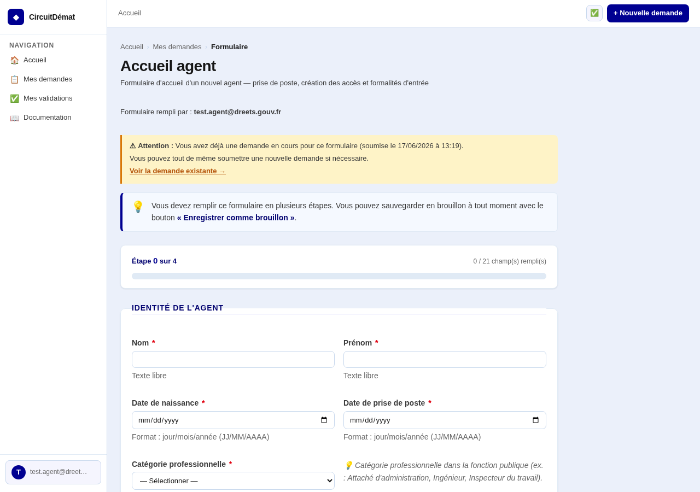 |
| **Suivi des demandes** | Timeline visuelle, barres de progression, badges d'urgence deadline | 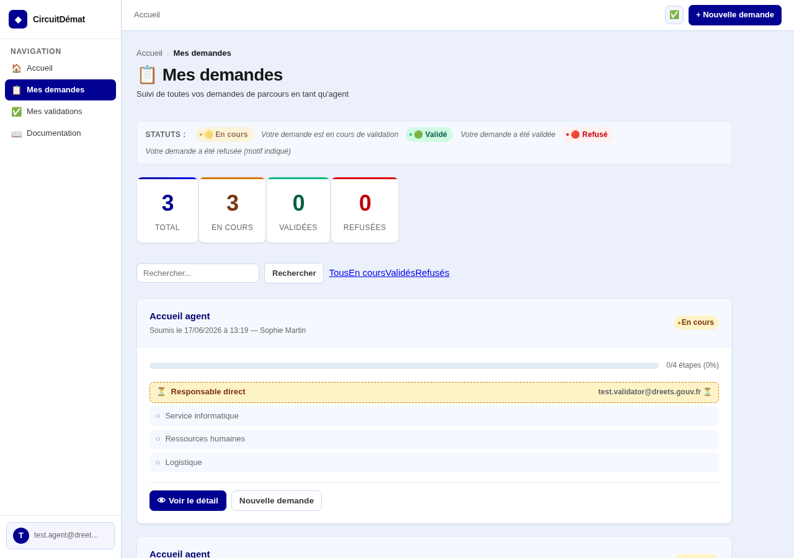 |
| **Détail complet** | Barre de progression, diagramme du circuit de validation, deadline, historique des validations | 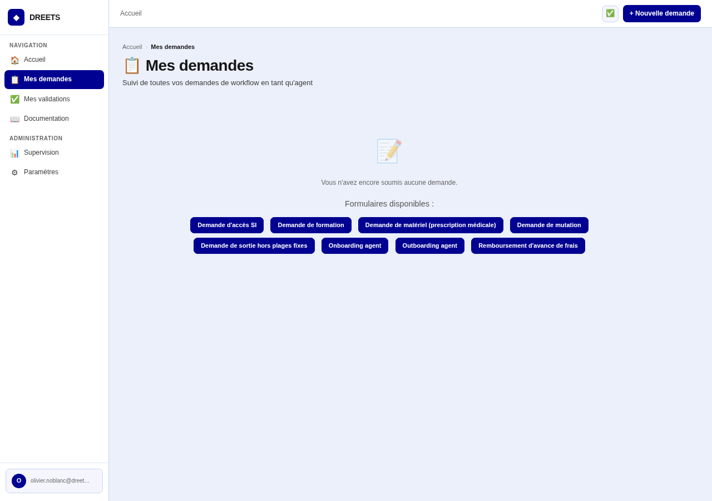 |
| **Notifications email** | Confirmation de soumission, refus avec motif, validation finale du circuit | — |
| **Annulation en cours** | L'agent peut annuler une demande tant qu'elle n'est pas clôturée | — |
| **Droits RGPD** | Accès, rectification, effacement, mentions légales en bas de chaque formulaire | — |

### Pour les validateurs

| Fonctionnalité | Description | Capture |
|---|---|---|
| **Validation par email** | Lien à usage unique, aucune authentification nécessaire (accessible hors réseau DREETS) | — |
| **Dashboard validateur** | Tokens en attente, historique, détection des tokens expirés | 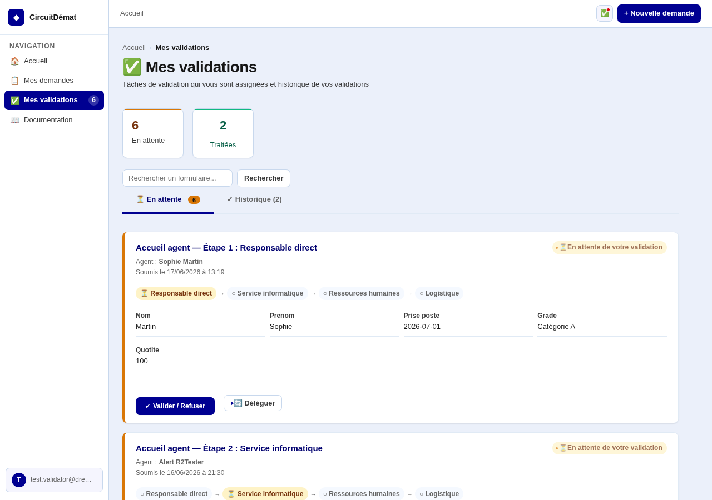 |
| **Progression visible** | Diagramme du circuit de validation affiché avant chaque décision | 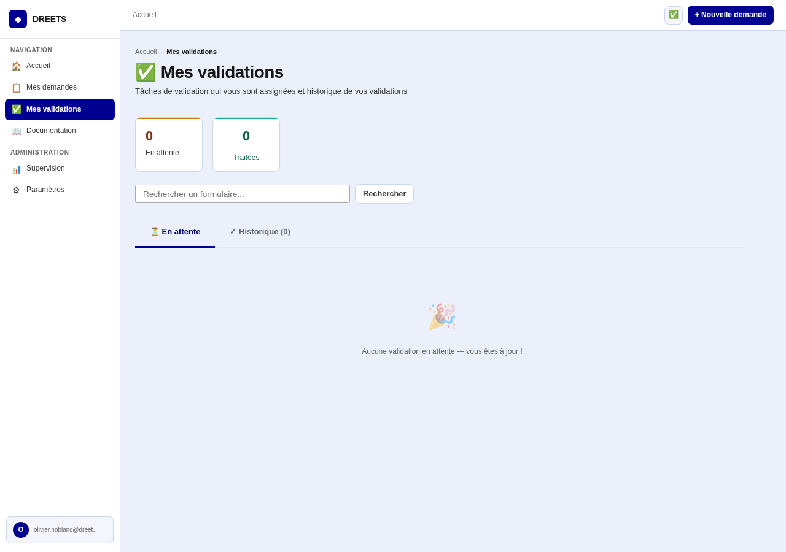 |
| **Délégation** | Transfert d'une validation à un collègue, tracé dans l'historique avec motif | — |
| **Commentaire facultatif** | Ajout d'un commentaire lors de la validation ou du refus | — |

### Pour les administrateurs

| Fonctionnalité | Description | Capture |
|---|---|---|
| **Dashboard de supervision** | Vue d'ensemble, filtres, pagination, export CSV, deadline colorée | 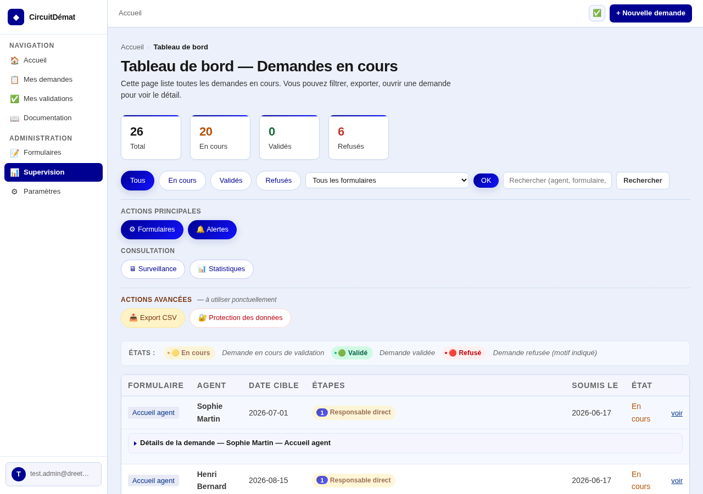 |
| **Form builder visuel** | Création de formulaires sans compétence technique, auto-génération du nom technique | 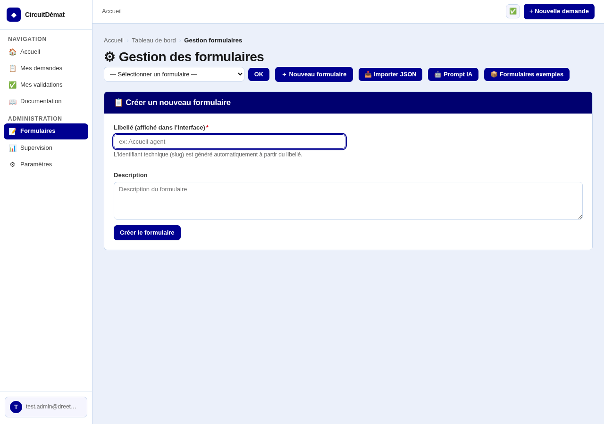 |
| **Prévisualisation** | Aperçu exact du formulaire tel que l'agent le verra | 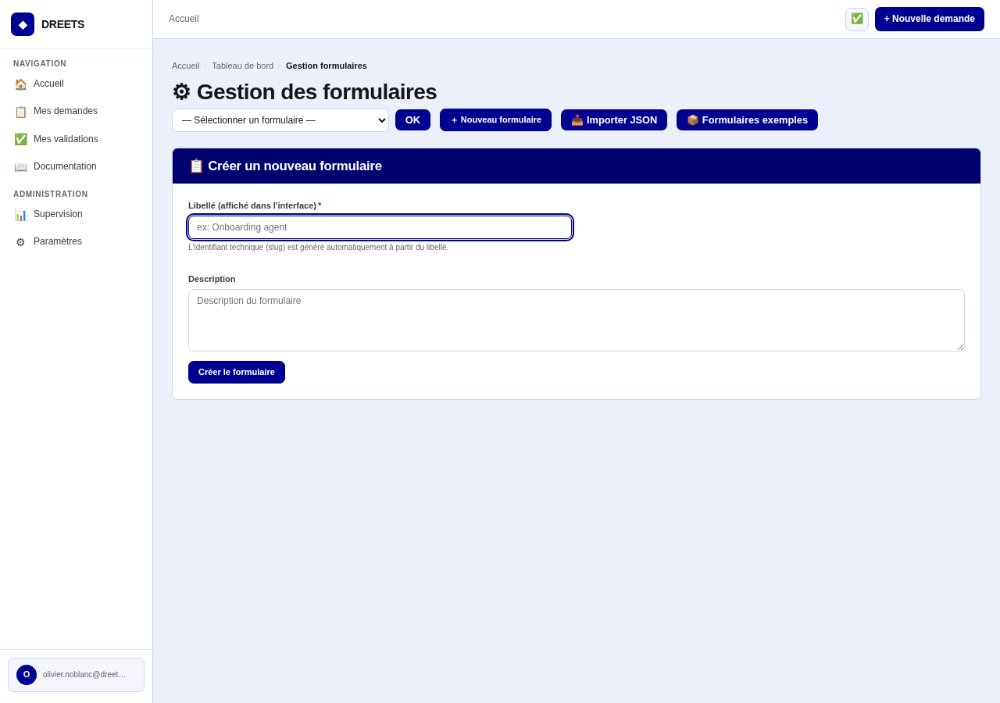 |
| **Circuit de validation** | Étapes séquentielles ou parallèles, destinataires multiples, recipients dynamiques `{{champ}}` | — |
| **Alertes J-N** | Alertes automatiques N jours avant une deadline, 6 cibles de notification (admin ou email personnalisé) — **réparées en v5.22.0** (bug `generate_uuid()` en SQL) | 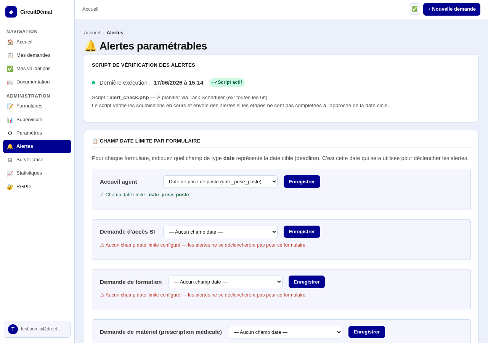 |
| **Monitoring** | Métriques, tokens bloqués, tokens expirés, SMTP health, donut CSS, audit log | 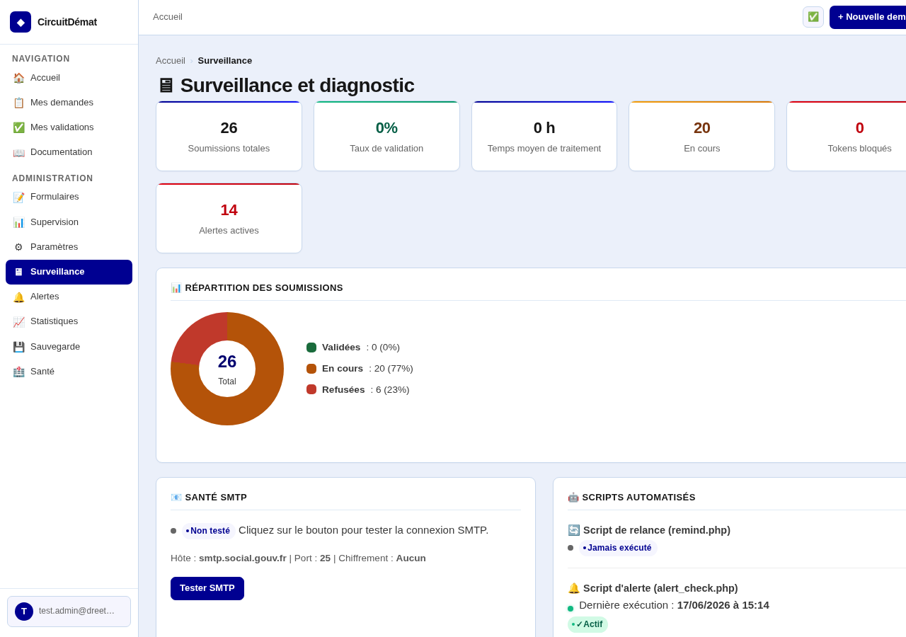 |
| **Statistiques** | Volumes globaux, par période / formulaire / validateur, graphique de répartition | — |
| **Tableau de suivi propriétaire** | Page `form_tracking.php` réservée aux owners d'un formulaire (cloisonnement strict) | — |
| **Régénération de tokens** | Renvoi d'un lien de validation pour un validateur bloqué | — |
| **Annulation de demande** | Clôture immédiate avec notification de l'agent | — |
| **Paramètres SMTP** | Configuration complète du serveur mail depuis l'interface (super admin) | 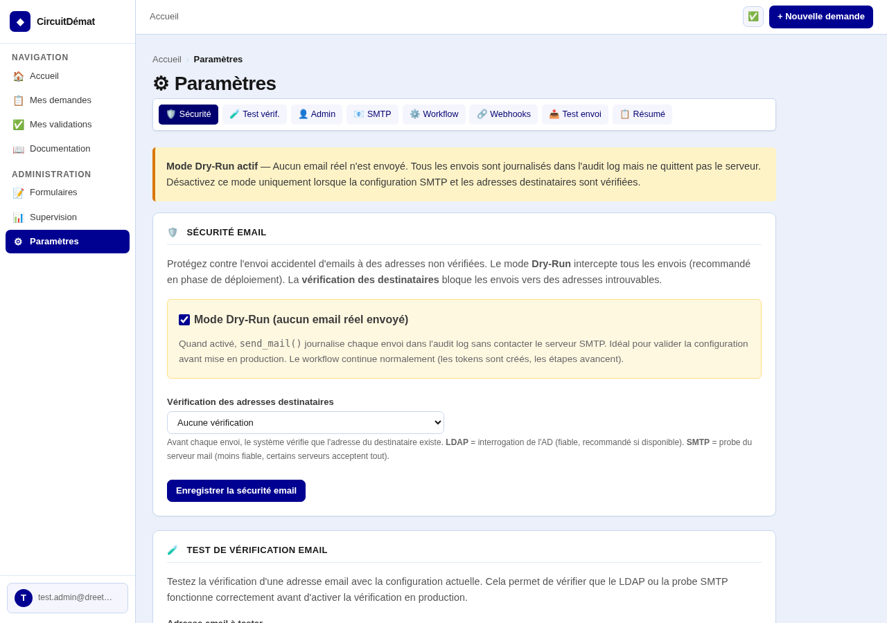 |
| **Gestion des accès** | Demande, approbation, révocation des accès admin (super admin) | 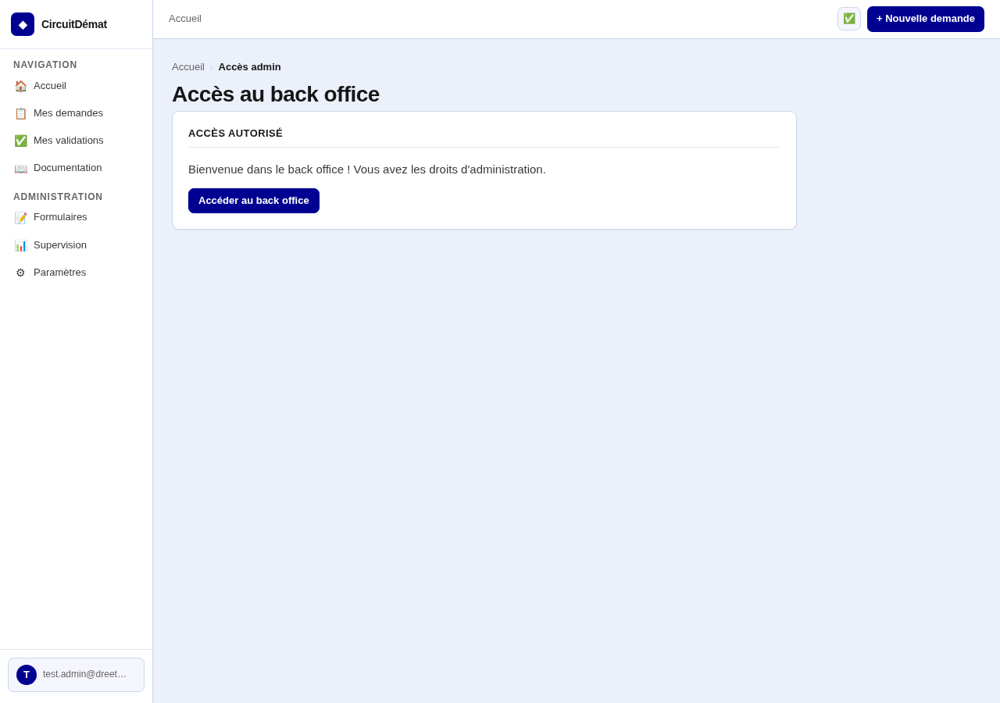 |
| **Conformité RGPD** | Mentions légales, durée de conservation, export JSON, anonymisation, purge automatique | — |
| **Sauvegarde / restauration** | Téléchargement .db et restauration depuis l'interface | — |
| **Health check** | Page `health.php` (HTTP 200/503) pour la supervision externe | — |
| **Webhooks** | Notifications JSON sur événements clés (validation, refus, clôture) pour intégration SI | — |
| **Documentation in-app** | Guide utilisateur complet accessible depuis la barre de navigation | 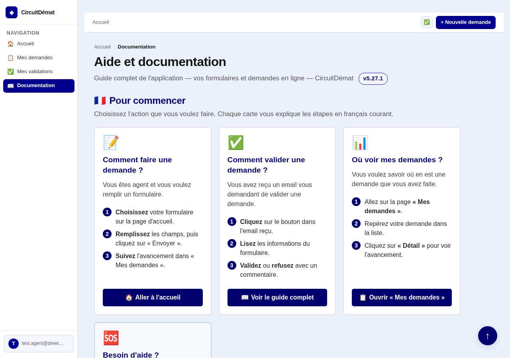 |
| **Journal des versions** | `CHANGELOG.md` parsé et affiché dans l'interface |  |

---

## Architecture technique

| Composant | Technologie |
|---|---|
| Langage | PHP 8 procédural — aucun framework |
| Base de données | SQLite (embarquée, migration automatique versionnée, mode WAL) |
| CSS | Pur — stylesheet partagée via `style.php` (`require_once`), design Marianne conforme RGAA |
| JavaScript | Aucun (CSP `script-src 'none'`) — validation HTML5 native |
| Authentification | Windows Auth (IIS + Kerberos) via `$_SERVER['AUTH_USER']` |
| Mail | PHPMailer (seule dépendance vendored) |
| Tâches planifiées | **Lazy cron** intégré (depuis v4.2.0) — `remind.php` et `alert_check.php` s'exécutent au premier accès PDO, aucun Planificateur de tâches Windows requis |
| Sécurité | CSRF, PDO prepared statements, chiffrement AES-256-CBC des settings sensibles, headers HTTP complets (CSP, HSTS, X-Frame-Options), rate limiting IIS natif |

### Principes

- **Zéro framework** : pas de Laravel, Symfony, React, Vue, Alpine
- **Zéro CDN** : aucune ressource externe, tout est local
- **Zéro fichier .css** : le CSS passe exclusivement par `style.php`
- **Future-proof** : le code doit tourner sans modification dans 10 ans
- **KISS** : chaque fichier fait une chose, pas d'abstraction inutile
- **Erreurs visibles** : `display_errors=1` même en prod (sauf TEST_MODE)

---

## Déploiement

### Prérequis

- Windows Server avec IIS + PHP 8 FastCGI
- Authentification Windows (Kerberos) activée sur IIS
- SMTP accessible (intranet par défaut)
- Accès en écriture aux répertoires `db/` et `cache/`
- Extensions PHP : `pdo_sqlite`, `mbstring`, `ctype`, `openssl`

### Installation

1. Copier les fichiers dans `C:\inetpub\wwwroot\workflow\`
2. Adapter `config.php` (SMTP, email admin, BASE_URL) — ou utiliser `install.php` pour générer un `config.php` à partir d'un template
3. Accéder à l'application — la base SQLite est créée automatiquement au premier accès (migration v0→v11)
4. Vérifier l'état du système sur `health.php`
5. **Aucune tâche planifiée Windows à configurer** : `remind.php` (relances) et `alert_check.php` (alertes J-N) sont exécutés automatiquement par le mécanisme de **lazy cron** intégré (depuis v4.2.0) — ils tournent au premier accès PDO de l'heure / de la journée.
6. La **purge RGPD** des demandes clôturées au-delà de la durée de conservation est déclenchée manuellement depuis `rgpd.php` par un administrateur (bouton « Purge automatique »).

### Mise à jour

```powershell
.\update.ps1              # Mise à jour standard
.\update.ps1 -DryRun      # Simulation sans modification
```

Le script sauvegarde automatiquement l'existant et préserve `config.php`.

---

## Sécurité

| Mesure | Détail |
|---|---|
| CSRF | Tokens CSRF sur tous les formulaires POST, rotation après chaque POST réussi |
| Injection SQL | Requêtes préparées PDO exclusivement, validation centralisée `validate_input()` (9 règles) |
| Tokens de validation | `random_bytes(32)` — cryptographiquement sûrs, à usage unique, avec expiration |
| Validation emails | `filter_var(FILTER_VALIDATE_EMAIL)` sur tous les destinataires |
| Actions destructives | Protection par confirmation + CSRF |
| Liens d'approbation | En POST (pas d'effet de bord au GET) |
| Journal d'audit | Toutes les actions administratives tracées dans `audit_log` + `security_log()` |
| Chiffrement au repos | AES-256-CBC pour `smtp_pass`, `ldap_bind_pass`, `webhook_secret`, `app_test_secret` (clé via `APP_ENCRYPTION_KEY`) |
| Headers HTTP | CSP, HSTS (HTTPS), X-Content-Type-Options, X-Frame-Options, Referrer-Policy, Permissions-Policy |
| Rate limiting | Géré nativement par IIS (pas de duplication PHP) |
| Protection répertoires | `db/`, `classes/`, `PHPMailer/` bloqués via `web.config` IIS |
| Mode TEST sécurisé | Activation par variable d'environnement `APP_TEST_MODE` ou `APP_TEST_SECRET` (header seul bloqué en prod depuis v5.20.0) |

---

## Structure des fichiers

```
# Application — cœur (4 fichiers)
config.php            Configuration (protégée par update.ps1, SETTINGS_DEFAULTS)
helpers.php           Fonctions partagées + moteur workflow + DB + cache + sécurité
style.php             CSS commun (inclus via require_once) — design Marianne / RGAA
router.php            Routeur pour le serveur PHP intégré (dev only)

# Application — pages utilisateur (15 fichiers)
index.php             Accueil adapté au rôle (agent / validateur / admin)
form.php              Formulaire dynamique (?f=slug)
form_preview.php      Prévisualisation admin (?form_id=N)
validate.php          Validation par token (?t=TOKEN) — accessible sans auth Windows
submission_view.php   Détail complet d'une demande (?id=N)
my_submissions.php    Suivi agent (« Mes demandes »)
my_validations.php    Dashboard validateur (« Mes validations »)
dashboard.php         Supervision admin
form_tracking.php     Tableau de suivi propriétaire (owners + admins)
stats.php             Statistiques et reporting
monitoring.php        Observabilité + audit log + SMTP health
admin_access.php      Gestion des accès admin (demande / approbation / révocation)
admin_forms.php       Back office formulaires (CRUD + champs + étapes + recipients)
admin_alerts.php      Configuration des alertes J-N
admin_settings.php    Paramètres SMTP, relances, webhooks (super admin)

# Application — utilitaires (8 fichiers)
docs.php              Documentation utilisateur in-app
changelog.php         Journal des versions (parse CHANGELOG.md)
rgpd.php              Conformité RGPD (mentions, export, anonymisation, purge)
backup.php            Sauvegarde et restauration .db
download.php          Téléchargement sécurisé des pièces jointes
confirm_action.php    Confirmation d'actions sensibles
health.php            Health check (HTTP 200/503 pour supervision externe)
screenshot.php        Sert les captures depuis docs/screenshots/ (contourne IIS)

# Installation / déploiement (2 fichiers)
install.php           Assistant de génération de config.php
update.ps1            Script PowerShell de mise à jour

# Scripts CLI (2 fichiers) — exécutés par lazy_cron, pas de Task Scheduler requis
alert_check.php       Vérification des deadlines + envoi des alertes J-N (lazy_cron 1×/jour)
remind.php            Relance automatique des validateurs en attente (lazy_cron 1×/heure)

# Classes (1 dossier)
classes/              DatabaseMigrations.php (migrations v0→v11 + seeding) + web.config

# Tests (8 fichiers PHP + 4 Playwright)
test_unit.php         Suite de tests unitaires CLI (282 tests)
test_advanced.php     Tests avancés (workflow, délégation, send_mail)
test_e2e.php          Tests end-to-end PHP
test_all.php          Suite de tests d'intégration
test_api.php          API de test (header X-Test-Mode sécurisé)
test_http.php         Suite de tests HTTP
test_bootstrap.php    Bootstrapper commun aux tests
test_refactor.php     Tests ciblés pour refactoring v5.14.0
test_v4.php           Tests de régression v4.x
playwright_test.js    Tests Playwright (parcours agent / validateur / admin)
playwright_advanced.js
playwright_comprehensive.js
take_screenshots.js   Régénération des captures docs/screenshots/

# Documentation (4 fichiers)
README.md             Ce fichier
CHANGELOG.md          Journal des modifications (source primaire de la version)
AGENT.md              Guide technique pour agent IA
agent.md              Suivi de remédiation audit (contraintes IIS, 40 constats)

# Dépendances (1 dossier)
PHPMailer/            Librairie PHPMailer 6.9.x (seule dépendance, vendored)

# Captures d'écran (1 dossier)
docs/screenshots/     21 captures de l'application
```

---

## Workflow de validation

```
┌─────────────┐     ┌─────────────────┐     ┌──────────────┐     ┌──────────────┐
│  Étape 1    │     │    Étape 2      │     │   Étape 3    │     │   Étape 4    │
│ Responsable │────→│ Service info.   │────→│ RH + Logist. │────→│  Direction   │
│  direct     │     │                 │     │  (parallèle) │     │              │
└─────────────┘     └─────────────────┘     └──────────────┘     └──────────────┘
     ↓ mail              ↓ mail               ↓ ↓ mail              ↓ mail
  Token unique        Token unique         2 tokens             Token unique
  Valider/Refuser     Valider/Refuser      Les 2 doivent        Valider/Refuser
                                            être validés
```

Chaque étape génère un token cryptographique envoyé par email au validateur. Le validateur clique sur le lien, voit la progression du circuit, et prend sa décision (valider ou refuser avec motif). Quand toutes les étapes sont validées, l'agent reçoit une confirmation. En cas de refus, le workflow s'arrête et l'agent est notifié avec le motif.

Les étapes peuvent être **séquentielles** (ordres différents) ou **parallèles** (même ordre — tous les destinataires doivent valider). Les recipients peuvent être **dynamiques** via la syntaxe `{{nom_du_champ}}` (résolus à partir des données du formulaire à l'exécution).

---

## Changelog récent

> Le journal complet est dans [`CHANGELOG.md`](CHANGELOG.md) — 30+ versions documentées.

### [5.22.0] — 2026-06-16 — Remédiation audit Wave 4 + Wave 5

- **Architecture** : audit code mort (76 fonctions), déduplication (`get_submission_with_form_label()`), gestion d'erreurs consistante (`render_error_page()`), couche de cache file-based générique (`cache_get/set/clear()`), 7 patterns N+1 fixés via batched queries, 10 hardcodages remplacés par settings.
- **Sécurité (Wave 5)** : 2 commentaires sanitizés, audit mots de passe faibles (0 trouvé), **+86 nouveaux tests unitaires** (validate_input, encrypt/decrypt_setting, parse_date, security_log, security_headers, rate_limit_check).
- **Tests** : 273 tests unitaires (1 échec pré-existant — fixé en R2-TESTER).

### [5.21.x] — 2026-06-16 — Sécurité Wave 1-3 + IIS compat

- **v5.21.0** : 15 correctifs sécurité sur 11 fichiers — contrôle d'accès sur fonctions sensibles, durcissement upload, validation UUID sur tous les IDs, protection CLI-only pour scripts cron, erreurs n'exposant plus d'info système, validation centralisée `validate_input()`, chiffrement AES-256-CBC des settings sensibles, headers HTTP complets, rate limiting étendu, cookies sécurisés, logs sanitizés.
- **v5.21.1** : `web.config` réécrit pour IIS 10+ standard (sans URL Rewrite Module), erreurs PHP toujours affichées même en prod.
- **v5.21.2** : retrait du `web.config` racine (configuration IIS gérée hors dépôt).

### [5.20.0] — 2026-06-16 — Audit d'architecture (22 correctifs)

- **CRITICAL** : TEST_MODE activable par header HTTP corrigé (S-01), XSS dans `render_error_page()` corrigé (S-02), injection SQL dans `get_tokens_for_submission()` corrigée (S-03), décalage fuseau horaire PHP/SQLite corrigé (S-04).
- **HIGH** : `require_admin()` sur dashboard, rotation CSRF après POST, validation HTTP_HOST, `REMOTE_ADDR` uniquement, régénération de session.
- **Architecture** : transactions workflow, validation atomique de jeton, migration v9 sécurisée, lazy cron différé en shutdown, isolation CLI, cookie security, CSP `script-src 'none'`.
- **Tests** : 399 tests PHP (0 échec).

### Bug fix alertes J-N (R2-CTO, post-v5.22.0)

Le bug **`generate_uuid()` utilisé en SQL SQLite** (la fonction n'existe pas en SQLite natif) empêchait la création de règles d'alerte via `admin_alerts.php` et l'envoi d'alertes via `alert_check.php` — la feature différenciante « Alertes J-N » était silencieusement cassée depuis plusieurs versions (P-01 / T-01 / O-02). **Réparé en R2-CTO** (Sprint 1) : les 3 INSERT concernés (`admin_alerts.php:43`, `alert_check.php:116`, `test_api.php:177`) génèrent désormais l'UUID côté PHP et le bindent en paramètre. 3 nouveaux tests (R2-TESTER) blindent la non-régression.

---

## Conformité RGPD

- **Durée de conservation** : configurable (défaut 24 mois après clôture)
- **Purge automatique** : exécutée via lazy cron toutes les 24h (`rgpd_auto_purge()`)
- **Droits utilisateur** : accès, rectification, effacement (page `rgpd.php`)
- **Anonymisation** : les soumissions purgées sont anonymisées (email → "anonymized", données → supprimées)
- **Journal d'audit** : toutes les actions RGPD sont tracées dans `audit_log`

Voir : `pages/rgpd.php`, `lib/rgpd.php`, `docs/declaration-rgaa.md`

## Conformité RGAA 4.1

Déclaration d'accessibilité : `docs/declaration-rgaa.md`

CircuitDémat est **partiellement conforme** au RGAA 4.1. Les non-conformités
connues (diagrammes SVG, tri de tableaux, notifications toast) sont documentées
dans la déclaration.

## Facteur bus (Bus Factor)

> **Le facteur bus actuel est de 1.**

Le **facteur bus** (bus factor) est le nombre de personnes qui doivent être
indisponibles (départ, maladie, accident) pour que le projet devienne
inmaintenable. À 1, une seule personne connaît tout le code.

### Risques d'un facteur bus à 1

- **Départ** : si la personne quitte, personne ne peut reprendre
- **Maladie** : absence de 2 semaines = bugs non corrigés
- **Concentration de connaissance** : décisions d'architecture non documentées

### Plan pour augmenter le facteur bus

| Action | Statut | Priorité |
|--------|--------|----------|
| Documentation architecture (`docs/`) | ✅ Partiellement fait | Haute |
| CHANGELOG complet | ✅ À jour (v10.0.9) | Haute |
| Tests automatisés (gate qualité) | ✅ 57 tests + 12 audits | Haute |
| Déclaration RGAA | ✅ Créée (`docs/declaration-rgaa.md`) | Moyenne |
| Guide de maintenance | ⬜ À faire | Moyenne |
| Formation d'un 2e développeur | ⬜ À planifier | Haute |
| Revue de code par pair | ⬜ À mettre en place | Moyenne |

---

## Licence

Usage interne DREETS Bourgogne-Franche-Comté. Code source ouvert pour audit et maintenance.
